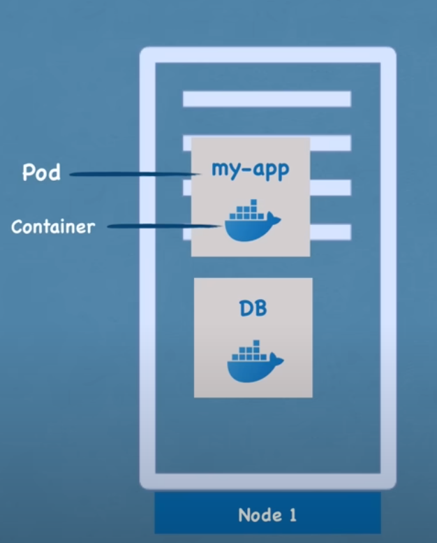
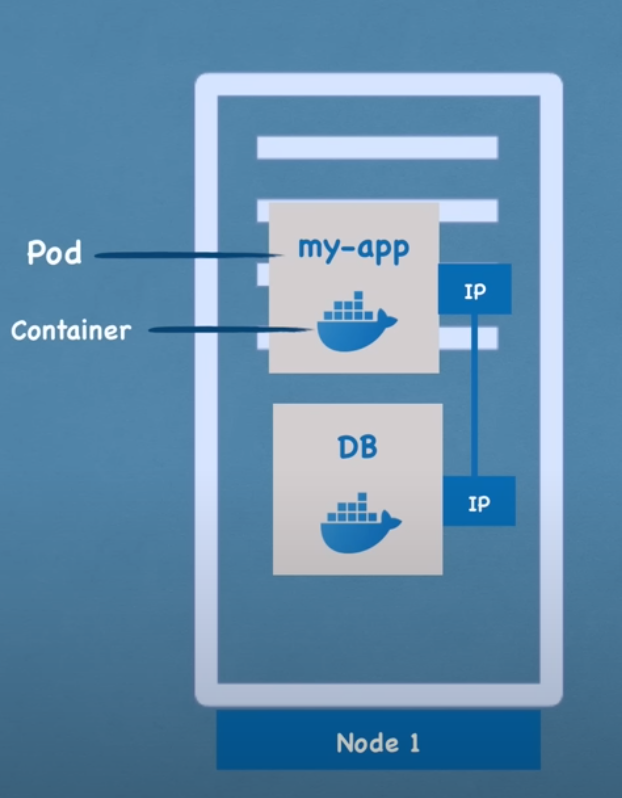

# Components in Kubernetes

## Node:
A **Node** is a physical or virtual machine in the Kubernetes cluster where applications (containers) run.

### What is Kuberneter Cluster??
A **Kubernetes cluster** is a group of machines (nodes) working together to run and manage containerized applications. 

#### Key Components:
1. **Control Plane**: Manages the cluster, schedules workloads, and stores cluster data.
2. **Worker Nodes**: Run application workloads (Pods) with components like Kubelet, Kube-Proxy, and a container runtime.
3. **Pods**: The smallest deployable units, running one or more containers.

## Pod:
A **Pod** in Kubernetes is the smallest deployable unit that you can create and manage. It represents a single instance of a running process in the cluster. You can run multiple containers in a pod but this is usually the case when containers are tightly coupled and are sharing data otherwise one application per pod is suggested. It is like one server and two containers are running on it.

As you can see from image, a pod is containing 2 container one for application and second for database. Kubernetes provides an **out-of-the-box virtual network** for Pods, ensuring seamless communication within the cluster and between pods.

- **Flat Networking Model**:
   - Each Pod gets a unique **IP address**.
   - Pods can communicate directly with each other using these IPs, without the need for NAT (Network Address Translation).

### **Service in Kubernetes**

A **Service** in Kubernetes is an abstraction that defines a logical set of Pods and a policy to access them. It provides a stable network endpoint, enabling communication with Pods, even if their IP addresses change.

### **Why Services Are Needed:**
Pods are ephemeral, meaning they can be created, deleted, or replaced at any time. Since Pods get dynamically assigned IP addresses, their IPs can change. A Service ensures consistent and reliable communication by acting as a static access point for a group of Pods.

---

### **Key Features of a Service:**

1. **Stable Endpoint**:
   - A Service provides a stable IP address and DNS name that remain constant, even if the underlying Pods change.

2. **Load Balancing**:
   - Services distribute incoming traffic across all Pods in their target group.

3. **Service Discovery**:
   - Kubernetes assigns a DNS name to each Service, allowing other components to discover it easily.

4. **Targeting Pods**:
   - A Service uses **labels and selectors** to identify the set of Pods it should route traffic to.

### Internal Service, External Service and Ingress 
An **internal service** in Kubernetes is used to expose applications within the cluster. It allows Pods and components to communicate without being accessible from outside the cluster.

An **external service** exposes applications outside the cluster, allowing users or systems to access them from the internet or other networks.

Ingress in Kubernetes is like a **gateway** that makes it easier to manage access to your services from outside the cluster. 

When you have multiple services running in your cluster, you don't want to expose each one individually with an external service because that can get complicated, especially if you have to manage separate URLs or IPs for each service. Instead, you can use an **Ingress**, which acts as a **single entry point** to handle all requests and route them to the appropriate services based on rules you define.

For example:
- You might want to access one service using `example.com/app1` and another service using `example.com/app2`. Instead of creating separate external services for both, you can use an Ingress to route the traffic to the correct service based on the URL.

Ingress can also handle:
- **Secure connections** (HTTPS).
- Custom domain names.
- Path-based or subdomain-based routing.

In simple terms, Ingress simplifies access to your applications, makes your URLs look clean (e.g., using `https://example.com` instead of `NodeIP:NodePort`), and provides advanced features for managing traffic.

## ConfigMap and Secret

When your application needs to communicate with other components, like a **database**, it usually relies on a **service**. For instance, if your app communicates with a database, you might use a service called `mongodb-service`. This service's **URL or endpoint** is typically configured somewhere in your app, often in an **application properties file** or as an **environment variable**.

But here’s the issue:
- If the **service name or URL changes**, you’d have to:
  1. Update the configuration in the application code.
  2. Rebuild the application image.
  3. Push the updated image to your repository.
  4. Pull the new image into your Pod and restart it.

This is a **tedious process** for something as small as a database URL change.

### **ConfigMap**: Simplify External Configurations
To solve this, Kubernetes provides a component called **ConfigMap**.

- A **ConfigMap** is an **external configuration store** for your application.
- Instead of hardcoding configurations like the database URL into the app image, you put it in a **ConfigMap**.
- The Pod connects to the ConfigMap, and your app reads the configuration data from there.

For example, if the database service name changes from `mongodb-service` to `mongo-db`, you just update the ConfigMap. No need to rebuild the application image or restart Pods manually. The app automatically uses the new value when the Pod restarts or refreshes.

### **Secrets**: Secure Sensitive Information
Now, besides URLs, your app might also need **sensitive data** like database usernames, passwords, API tokens, or certificates. 

You could store these in a ConfigMap, but this is **insecure** because ConfigMaps store data as **plain text**. To handle sensitive data securely, Kubernetes provides **Secrets**.

- A **Secret** is similar to a ConfigMap but designed for **sensitive data**.
- It stores information in a **Base64-encoded format** to prevent easy access.
- Examples of data stored in Secrets:
  - Database usernames and passwords.
  - TLS/SSL certificates.
  - API keys.

---

### **How They Work Together:**
1. **ConfigMap**: Use it for non-sensitive configuration data, like service URLs or app settings.
2. **Secret**: Use it for sensitive data, like credentials or certificates.

Both ConfigMaps and Secrets are connected to Pods, so the app running inside the Pod can access the data.

## Kubernetes Volumnes

### The Problem:
In Kubernetes, if a Pod (like your database Pod) is restarted or replaced, any **data stored inside the Pod** (in its container) will be **lost**. This is because the container’s file system is **ephemeral** (temporary). Losing database or log data like this would be **inconvenient** and **problematic** because you want your data to be stored reliably for the long term.

---

### The Solution: Kubernetes **Volumes**
To solve this, Kubernetes provides **Volumes**, which allow you to **attach persistent storage to a Pod**. This storage ensures that data is retained even if the Pod is restarted, deleted, or moved.

---

### **How Kubernetes Volumes Work**:
- A Volume is like an **external hard drive** connected to your Pod. 
- The data in the Volume persists outside the Pod's lifecycle, so it’s not tied to the Pod’s temporary file system.

---

### **Types of Kubernetes Volumes**:
1. **Local Storage**:
   - The Volume is stored on the **same node (physical server)** where the Pod is running.
   - **Limitation**: If the Pod is rescheduled to a different node, it can’t access the data unless it stays on the same node.

2. **Remote Storage**:
   - The Volume is stored on **external storage** like a cloud storage solution (AWS EBS, GCP Persistent Disk, Azure Disk) or a network-attached storage (NAS).
   - **Advantage**: The data is accessible from any node in the cluster.

---

### **Persistence with Persistent Volumes (PV) and Persistent Volume Claims (PVC)**:
Kubernetes introduces two concepts to manage persistent storage:

1. **Persistent Volume (PV)**:
   - A Persistent Volume is the actual physical storage resource.
   - It can be provisioned by an administrator or dynamically created.
   - It could be local (on the node) or remote (cloud or external storage).

2. **Persistent Volume Claim (PVC)**:
   - A Persistent Volume Claim is a **request for storage** made by a Pod.
   - Pods use PVCs to connect to the underlying PVs, abstracting the storage details.

---

### **How It Works**:
1. You create a **Persistent Volume (PV)** that specifies the storage backend (local or remote).
2. A **Persistent Volume Claim (PVC)** is created by your Pod to request a specific amount and type of storage.
3. Kubernetes binds the PVC to a suitable PV, and the Pod gets access to the storage.

Now, even if the Pod is restarted or rescheduled, the data remains intact in the storage.

## Deployment
When you deploy an application in Kubernetes, downtime is a critical issue to avoid, especially in production environments. If your application Pod crashes, restarts, or needs to be replaced (e.g., due to a new container image), it becomes temporarily unavailable, causing disruption to users. To prevent this, Kubernetes allows you to replicate your application Pod across multiple nodes, ensuring that there are always additional Pods to handle traffic. This is achieved using a component called a **Deployment**, which is essentially a blueprint for your application Pod. Instead of manually creating and managing individual Pods, a Deployment lets you define how many replicas of the Pod you want to run. It also simplifies scaling (increasing or decreasing the number of Pods) and updates, as Kubernetes handles rolling out changes to the Pods gradually, ensuring there’s no downtime. Deployments also leverage Kubernetes Services, which act as load balancers. The Service distributes incoming traffic to the available Pods, ensuring requests are routed to the least busy or healthiest Pod. This combination of Deployments and Services ensures high availability, so even if one Pod crashes, the remaining replicas continue serving user requests seamlessly.

## StatefulSet

However, things are more complicated when dealing with **stateful applications** like databases, where data consistency and persistence are crucial. For example, if you try to replicate a database Pod using a Deployment, you might run into issues because databases store state (data) that must remain consistent across replicas. If multiple replicas of a database Pod write to the same storage without proper coordination, it can lead to data corruption or inconsistencies. To address this, Kubernetes provides a special component called a **StatefulSet**. Like Deployments, StatefulSets allow you to create and manage multiple replicas of a Pod, but they are specifically designed for stateful applications. Each Pod in a StatefulSet has a stable, unique identifier (e.g., `db-0`, `db-1`) and its own persistent storage. This ensures that data is not lost or corrupted, even if the Pods are restarted or rescheduled on different nodes. StatefulSets also manage scaling while ensuring that database reads and writes are synchronized. That said, deploying databases using StatefulSets can be complex, as you are responsible for managing storage, backups, and replication. Because of this complexity, many organizations choose to host databases outside the Kubernetes cluster using cloud-managed database solutions (e.g., AWS RDS, Azure Database) while keeping their stateless application components inside the cluster. This approach balances simplicity and reliability, making Kubernetes an excellent tool for managing both stateless and stateful workloads.